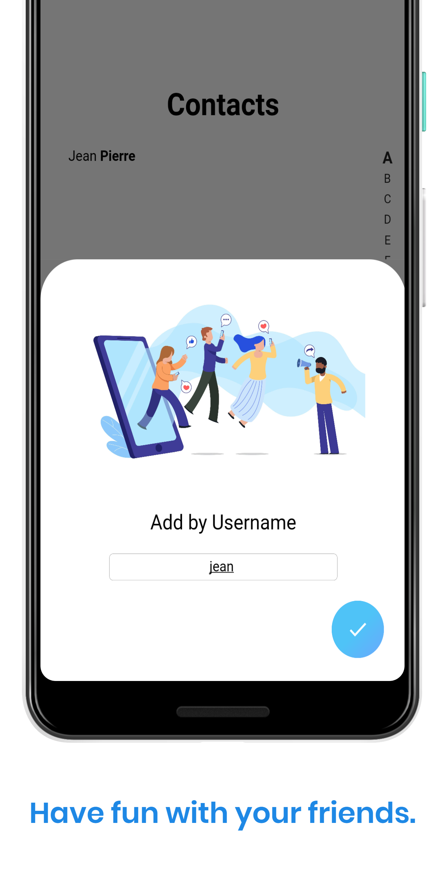
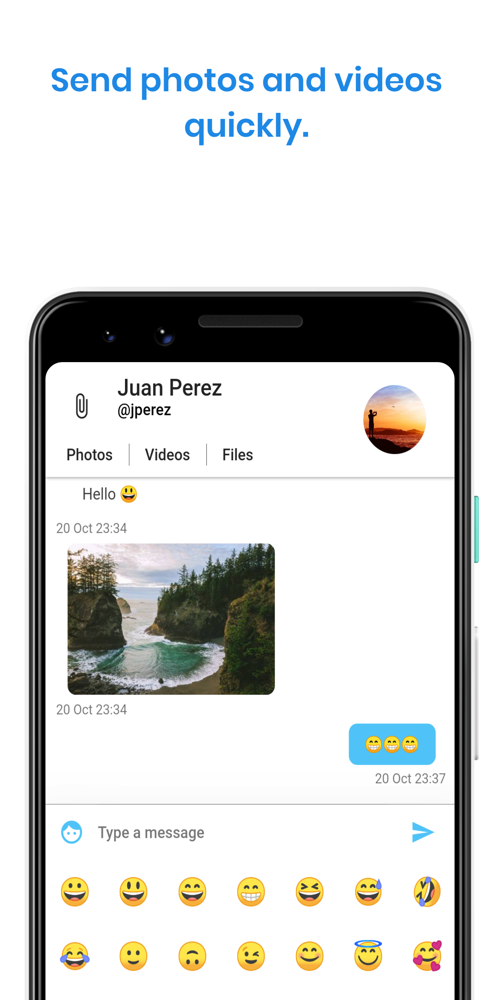

<h1 align="center"> Messenger 🤳</h1>
<p align="center">A messenger app built using flutter</p>

<p align="center">
    
    
    
    
</p>

<p align="center">
    <a href="https://travis-ci.com/vcjpierre/messenger"></a>
    <a href="https://opensource.org/licenses/MIT"></a>
    <a href="https://github.com/vcjpierre/flutter-messenger/graphs/commit-activity"></a>
    <a href="#"></a>
    <a href="#"></a>
</p>

## Getting Started

This project is a starting point for a Flutter application.

A few resources to get you started if this is your first Flutter project:

- [Lab: Write your first Flutter app](https://flutter.dev/docs/get-started/codelab)
- [Cookbook: Useful Flutter samples](https://flutter.dev/docs/cookbook)

For help getting started with Flutter, view our
[online documentation](https://flutter.dev/docs), which offers tutorials,
samples, guidance on mobile development, and a full API reference.

## Setup Firebase

Complete the whole Firebase setup for both Android and iOS. You will get two files while doing the setup, one for each platform. You have to place the google-services.json & GoogleService-Info.plist files in the respective directory of each platform. 

https://firebase.google.com/docs/flutter/setup

[Firebase authentication plugin](https://pub.dev/packages/firebase_auth)
[Google sign-in plugin installation instructions.](https://pub.dev/packages/google_sign_in#-readme-tab-)

## Deploying Firestore Security Rules using Firebase CLI 

- Install Firebase CLI
```
npm install -g firebase-tools
```
- Signing In To Firebase CLI 
```
firebase login
```
Go to the **server** directory. And run `firebase init` inside it. Choose **Firestore** and **Functions** when prompted for choices (We’ll need Cloud functions later).

- Deploying the Rules
```
firebase deploy — only firestore:rules
```

## Unit Testing 

```
flutter test --no-pub test/
```

## Credits

[60 Days Of Flutter : Building a Messenger from Scratch](https://medium.com/@adityadroid/60-days-of-flutter-building-a-messenger-from-scratch-ab2c89e1fd0f)
